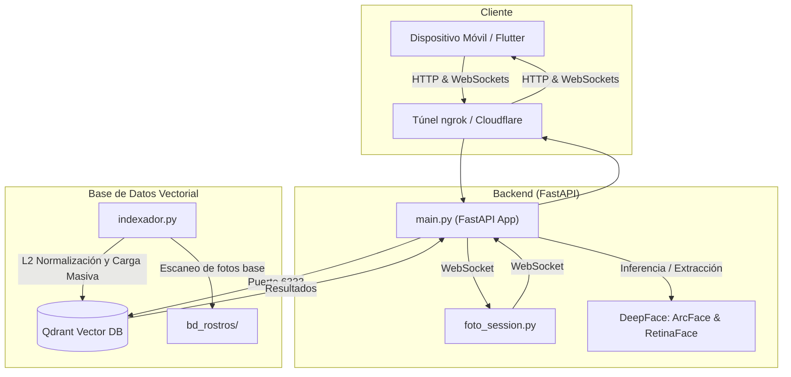
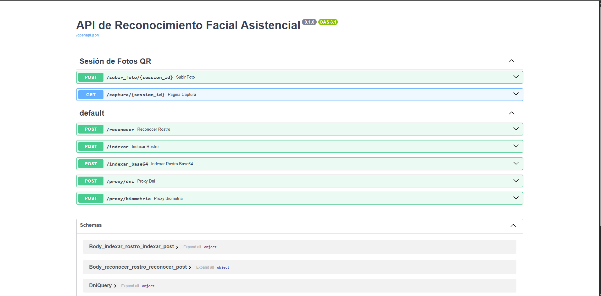
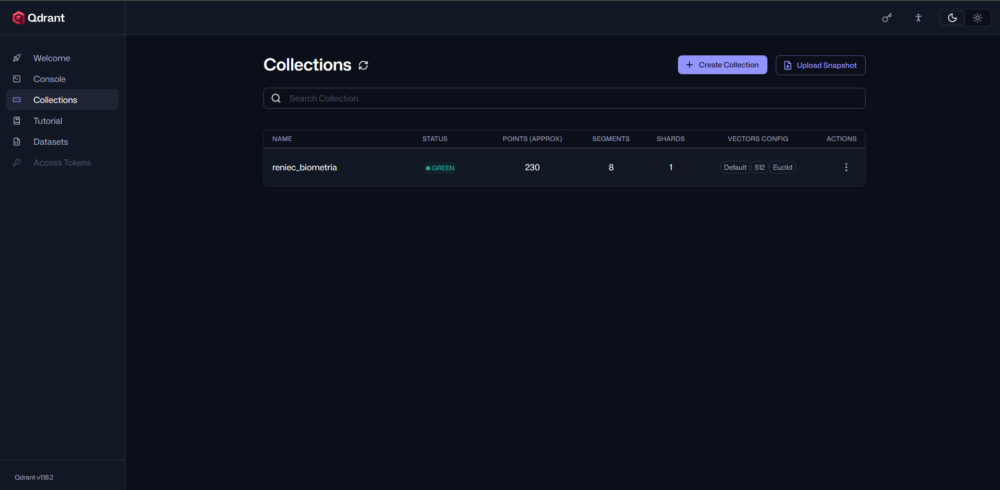
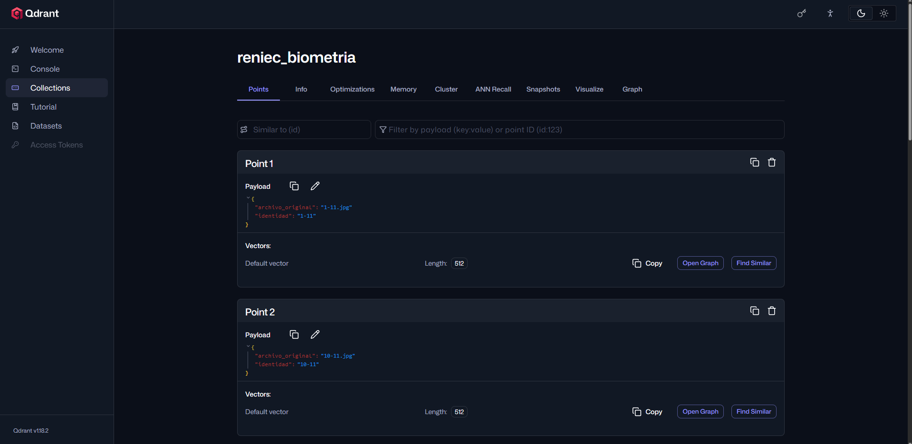

# 🛡️ Sistema de Reconocimiento Facial Asistencial (SIRE - API)

Este repositorio alberga la API de reconocimiento facial para el **Sistema de Información de Registro de Expedientes (SIRE)**. Se trata de un servicio backend de alto rendimiento desarrollado en **Python** con **FastAPI**. 

El sistema utiliza **DeepFace (ArcFace)** para extraer las características biométricas y mapas óseos tridimensionales de los rostros y los almacena/compara en una base de datos vectorial ultraveloz (**Qdrant**) para obtener búsquedas y verificaciones en milisegundos con alta certeza biométrica.

---

## 📐 Arquitectura General del Sistema

A continuación se muestra el flujo de interacción entre la aplicación móvil (Flutter), el túnel de comunicación segura, la API web en FastAPI y la base de datos vectorial:



---

## 🚀 Requisitos Previos

Antes de comenzar, asegúrate de cumplir con los siguientes requisitos en tu máquina de desarrollo:
1. **Python 3.10.x** (Recomendado versión 3.10.11) ➔ [Descargar Python 3.10.11](https://www.python.org/ftp/python/3.10.11/python-3.10.11-amd64.exe)
2. **Docker Desktop** (Necesario para levantar el motor de base de datos vectorial Qdrant).
3. **Tarjeta Gráfica NVIDIA** (Opcional, requerida únicamente si deseas habilitar aceleración por hardware/GPU).
4. **Ngrok** o **Cloudflared** (Para exponer la API al exterior y comunicarla con el dispositivo físico en Flutter).

---

## 🛠️ Guía de Instalación y Configuración (Paso a Paso)

### Paso 1: Clonar y Acceder al Proyecto
Abre la terminal en la raíz del proyecto:
```bash
cd api_reconocimiento_sire
```

### Paso 2: Crear y Activar el Entorno Virtual
Es fundamental aislar las dependencias del proyecto usando un entorno virtual (`venv`).

**En Windows (PowerShell):**
```powershell
# Crear el entorno virtual en la carpeta "env" usando Python 3.10
py -3.10 -m venv env

# Activar el entorno virtual
.\env\Scripts\Activate.ps1
```

### Paso 3: Instalar Dependencias
Instala todas las librerías necesarias configuradas en el archivo de requerimientos:
```bash
pip install -r requirements.txt
```

### Paso 4: Levantar la Base de Datos Vectorial (Qdrant)
Qdrant se ejecuta en un contenedor Docker y escucha en los puertos `6333` (HTTP) y `6334` (gRPC).

*   **Opción A: Levantar un contenedor limpio (Vacío)**
    ```bash
    docker run -d --name qdrant_local -p 6333:6333 -p 6334:6334 qdrant/qdrant
    ```
*   **Opción B: Levantar restaurando tu Backup de datos** (Si ya tienes una carpeta con base de datos mapeada llamada `qdrant_backup`):
    ```bash
    docker run -d --name qdrant_restaurado -p 6333:6333 -p 6334:6334 -v "C:\Ruta\Hacia\Tu\qdrant_backup:/qdrant/storage" qdrant/qdrant
    ```

---

## ⚡ Modos de Ejecución

### 💻 Modo A: Ejecución Estándar (CPU)
Si no cuentas con una tarjeta gráfica NVIDIA, puedes correr el servicio directamente sobre tu procesador (CPU):

1.  **Encender la API en Python (Uvicorn):**
    ```powershell
    python -m uvicorn main:app --reload
    ```
    *Esto levantará el servidor local de desarrollo en `http://localhost:8000`.*

2.  **Verificar la documentación interactiva:**
    Abre tu navegador e ingresa a `http://localhost:8000/docs`. Deberías ver la interfaz Swagger con los endpoints disponibles:
    
    

---

### 🚀 Modo B: Ejecución Optimizada (NVIDIA GPU - CUDA)
Para lograr respuestas en menos de 0.2 segundos y procesar imágenes al instante, puedes configurar el motor TensorFlow para que utilice la aceleración por hardware (GPU).

#### 1. Configuración de CUDA y cuDNN
Para habilitar el soporte de tarjeta gráfica en TensorFlow 2.10.0 en Windows, descarga e instala las siguientes versiones de NVIDIA:

1.  **CUDA Toolkit 11.2**: [Descargar CUDA 11.2 (exe)](https://developer.download.nvidia.com/compute/cuda/11.2.2/local_installers/cuda_11.2.2_461.33_win10.exe). Instálalo siguiendo los pasos predeterminados.
2.  **cuDNN v8.1.0 (para CUDA 11.2)**: [Descargar cuDNN 8.1.0 (zip)](https://developer.nvidia.com/compute/machine-learning/cudnn/secure/8.1.0.77/11.2_20210127/cudnn-11.2-windows-x64-v8.1.0.77.zip) (Requiere cuenta de NVIDIA Developer).
    
    *   **Paso 1.1**: Extrae el archivo ZIP de cuDNN. Obtendrás una carpeta llamada `cuda` con los subdirectorios `bin`, `include` y `lib`.
    *   **Paso 1.2**: Abre la ruta de instalación de CUDA (usualmente `C:\Program Files\NVIDIA GPU Computing Toolkit\CUDA\v11.2`).
    *   **Paso 1.3**: Copia los archivos de las carpetas de cuDNN a sus correspondientes carpetas en CUDA:
        *   Archivos de `cuda/bin/` ➔ `v11.2/bin/`
        *   Archivos de `cuda/include/` ➔ `v11.2/include/`
        *   Archivos de `cuda/lib/x64/` ➔ `v11.2/lib/x64/`

#### 2. Configurar las Variables de Entorno en Windows
Debes indicarle al sistema operativo dónde se encuentran las bibliotecas dinámicas de CUDA:
1.  Presiona la tecla **Win** y escribe `Editar las variables de entorno del sistema`.
2.  Haz clic en **Variables de entorno...**.
3.  En la sección *Variables del sistema*, selecciona la variable **Path** y presiona **Editar**.
4.  Añade una nueva entrada con la siguiente ruta (si no existe):
    ```text
    C:\Program Files\NVIDIA GPU Computing Toolkit\CUDA\v11.2\bin
    ```
5.  Guarda los cambios e **inicia una nueva terminal** (o reinicia tu VSCode) para que el sistema reconozca la configuración de la GPU.

Una vez configurado, ejecuta el servidor normalmente con:
```powershell
python -m uvicorn main:app --reload
```

---

## 📂 Estructura Limpia del Proyecto

El repositorio cuenta ahora con la siguiente estructura organizada y portable:

```text
api_reconocimiento_sire/
│
├── docs/                     # Recursos de documentación del proyecto
│   └── images/               # Capturas de pantalla e imágenes de referencia
│       ├── fastapi_swagger.png
│       ├── qdrant_collections.png
│       └── qdrant_vectors.png
│
├── bd_rostros/               # Base de datos física de rostros cargados
├── entrada/                  # Carpeta de entrada temporal de imágenes para pruebas
├── env/                      # Entorno virtual de Python (Excluido de Git)
├── snapshots/                # Copias de seguridad de Qdrant DB
│
├── .env                      # Variables de entorno y llaves de API seguras
├── .gitignore                # Reglas de exclusión de control de versiones
├── indexador.py              # Script para extraer vectores y realizar carga inicial masiva
├── main.py                   # Archivo principal de FastAPI (Inicializador de la API)
├── foto_session.py           # Módulo WebSocket para la sincronización QR con el celular
└── requirements.txt          # Lista de dependencias del proyecto
```

---

## 🖼️ Panel de Control y Base de Datos Vectorial (Qdrant Dashboard)

Qdrant ofrece un panel visual para inspeccionar las colecciones y vectores matriculados. Puedes ingresar desde tu navegador a:
👉 [http://localhost:6333/dashboard](http://localhost:6333/dashboard)

### Visualización de Colección:
Aquí podrás ver la colección `reniec_biometria` en estado **GREEN** y el recuento aproximado de puntos indexados:



### Inspección de Vectores:
Puedes explorar los puntos biométricos individuales, sus payloads (identidad y archivo origen) y sus vectores numéricos de 512 dimensiones generados por ArcFace:



---

## 🧬 Lógica de Certeza Biométrica

La API no solo busca coincidencias, sino que evalúa la distancia matemática L2 normalizada (distancia euclidiana) para determinar la confianza del resultado:

*   🟢 **ALTA**: Distancia L2 < `0.90` (Identidad 100% confirmada, rasgos óseos idénticos).
*   🟡 **MODERADA**: `0.90` <= Distancia < `1.05` (Similitud estructural fuerte. Recomendable confirmación visual).
*   🟠 **BAJA**: `1.05` <= Distancia <= `1.13` (Certeza reducida. Peligro de falso positivo por rasgos faciales genéricos).
*   🔴 **RECHAZO**: Distancia > `1.13` (Persona desconocida, límites estrictos superados).

---

## 📡 Conexión con la App Móvil (Ngrok)

Para exponer de forma segura tu servidor web local a Internet y poder conectarlo con la app móvil en Flutter:

1.  Abre una pestaña adicional en la terminal.
2.  Ejecuta el túnel en el puerto local de la API (`8000`):
    ```powershell
    ngrok http --domain=knoblike-haylee-unamplified.ngrok-free.dev 8000
    ```
3.  Tu API estará disponible públicamente y de forma encriptada en:
    `https://knoblike-haylee-unamplified.ngrok-free.dev`
4.  Puedes acceder a `/docs` en dicha URL o configurar este enlace base en el archivo de constantes de tu App de Flutter.

---

## 📥 Indexación Manual de Rostros Base

Para cargar y registrar de forma masiva las identidades conocidas:
1.  Coloca las imágenes correspondientes en la carpeta `bd_rostros/` (nombradas preferiblemente con el identificador/DNI del paciente, por ejemplo, `70573650.jpg`).
2.  Ejecuta el indexador:
    ```powershell
    python indexador.py
    ```
    *El indexador procesará cada imagen nueva, extraerá el embedding facial a través de DeepFace y lo subirá en masa (Bulk) a Qdrant.*